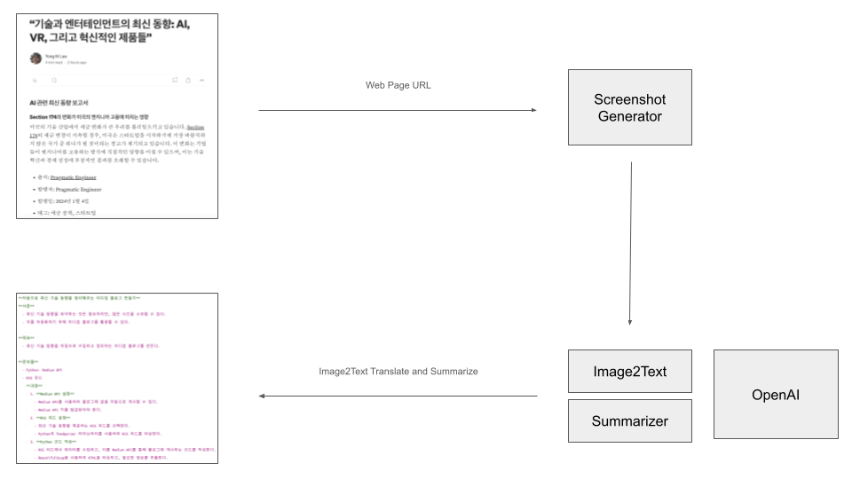

# page-digest

웹 페이지를 빠르게 요약해주는 서비스를 지원합니다.

---

# Conceptual Architecture

page-digest의 Architecture는 아래와 같습니다.




# Getting Started

## Prerequisites

프로그램을 실행하기 위해 설치해야 하는 소프트웨어들은 다음과 같습니다.

- poetry
- virtualenv (pyenv, python 3.10)

## Local Development

로컬 환경에서 개발 및 실행하기 위한 환경 구성은 아래와 같습니다.

### Install Dependencies

```bash
$ poetry shell
$ poetry install --no-root
$ make install-pre-commit
```

### Configuration

- ./config/.env 파일을 구성해야 합니다.
- ./config/.env.sample 파일을 참고하세요.
- 활용되는 환경 변수는 다음과 같습니다.

| 환경변수              | 설명                                   |
|-------------------|--------------------------------------|
| OPENAI_MODEL_NAME | 사용되는 모델 이름 (e.g., gpt-4o-mini)       |
| OPENAI_API_KEY    | 사용되는 모델 키                            |
| LANGFUSE_ENABLED  | OpenAI 요청/응답 모니터링을 위한 langfuse 사용 여부 |
| DEBUG             | 디버깅 여부 (e.g., True/False)            |


## Execution Program

- 아래의 명령을 통해서 프로그램을 실행할 수 있습니다.
- 프로그램이 실행된 후, http://localhost:8000/doc에서 swagger를 확인하실 수 있습니다.

```bash
$ make rundev
poetry run uvicorn src.app.main:app --reload --port=8000 --host=0.0.0.0
INFO:     Will watch for changes in these directories: ['/Users/y9yk/dev/page-digest']
INFO:     Uvicorn running on http://0.0.0.0:8000 (Press CTRL+C to quit)
INFO:     Started reloader process [50265] using StatReload
Langfuse client is disabled since no public_key was provided as a parameter or environment variable 'LANGFUSE_PUBLIC_KEY'. See our docs: https://langfuse.com/docs/sdk/python/low-level-sdk#initialize-client
INFO:     Started server process [50270]
INFO:     Waiting for application startup.
INFO:     Application startup complete.
```

## Test

- pytest를 통해 테스트를 수행할 수 있습니다.
- 테스트에 필요한 환경변수는 .pytest.ini.sample을 참고하세요.
- 활용되는 환경 변수에 대한 설명은 다음과 같습니다.

| 환경변수             | 설명                       |
|------------------|--------------------------|
| timeout          | 요청에 대한 timeout 값 (초)     |
| path_page_digest | 테스트 대상이 되는 digest API 경로 |

```bash
$ make test
poetry run pytest ./src/tests/
Langfuse client is disabled since no public_key was provided as a parameter or environment variable 'LANGFUSE_PUBLIC_KEY'. See our docs: https://langfuse.com/docs/sdk/python/low-level-sdk#initialize-client
/Users/y9yk/dev/page-digest/.venv/lib/python3.10/site-packages/pytest_asyncio/plugin.py:208: PytestDeprecationWarning: The configuration option "asyncio_default_fixture_loop_scope" is unset.
The event loop scope for asynchronous fixtures will default to the fixture caching scope. Future versions of pytest-asyncio will default the loop scope for asynchronous fixtures to function scope. Set the default fixture loop scope explicitly in order to avoid unexpected behavior in the future. Valid fixture loop scopes are: "function", "class", "module", "package", "session"

  warnings.warn(PytestDeprecationWarning(_DEFAULT_FIXTURE_LOOP_SCOPE_UNSET))
============================================================================================================ test session starts =============================================================================================================
platform darwin -- Python 3.10.8, pytest-8.3.2, pluggy-1.5.0
rootdir: /Users/y9yk/dev/page-digest/src/tests
configfile: .pytest.ini
plugins: asyncio-0.24.0, playwright-0.5.1, anyio-4.4.0, base-url-2.1.0
asyncio: mode=strict, default_loop_scope=None
collected 1 item

src/tests/service/test_page_digest.py {"level": "DEBUG", "asctime": "2024-08-23 13:31:20,310935", "message": "", "module": "router", "request": "<starlette.requests.Request object at 0x107253520>", "digest_content_request": "url='https://medium.com/dlift/%EC%9E%90%EB%8F%99%EC%9C%BC%EB%A1%9C-%EC%B5%9C%EC%8B%A0-%EA%B8%B0%EC%88%A0-%EB%8F%99%ED%96%A5%EC%9D%84-%EC%A0%95%EB%A6%AC%ED%95%B4%EC%A3%BC%EB%8A%94-%EB%AF%B8%EB%94%94%EC%97%84-%EB%B8%94%EB%A1%9C%EA%B7%B8-%EB%A7%8C%EB%93%A4%EA%B8%B0-5a2585c2ded2' model='gpt-4o' max_tokens=2000"}
{"level": "INFO", "asctime": "2024-08-23 13:31:25,222057", "message": "d6b40972-0da4-45c4-b90e-dcf2631f61df: global POST http://test/digest/content 200 None -  127.0.0.1 - 4912.9021ms", "module": "logging_middleware"}
{"level": "DEBUG", "asctime": "2024-08-23 13:31:31,572739", "message": "### 텍스트 추출**자동으로 최신 기술 동향을 정리해주는 미디엄 블로그 만들기**---**서론**- 최신 기술 동향을 파악하는 것은 중요하지만, 많은 시간을 소모한다.- 이를 자동화하기 위해 미디엄 블로그를 활용할 수 있다.**목표**- 최신 기술 동향을 자동으로 수집하고 정리하는 미디엄 블로그를 만든다.**필요한 도구**- Python- Medium API- RSS 피드- BeautifulSoup- GitHub Actions**구현 방법**1. **Medium API 설정**   - Medium API를 사용하여 블로그에 글을 자동으로 게시한다.   - API 키를 발급받아 설정 파일에 저장한다.2. **RSS 피드 수집**   - 기술 관련 RSS 피드를 수집하여 최신 글을 가져온다.   - BeautifulSoup을 사용하여 RSS 피드에서 필요한 정보를 추출한다.3. **데이터 정리**   - 수집한 데이터를 정리하여 블로그 포스트 형식으로 변환한다.   - 제목, 요약, 링크 등을 포함한다.4. **GitHub Actions 설정**   - GitHub Actions를 사용하여 주기적으로 스크립트를 실행한다.   - 스크립트가 실행될 때마다 새로운 블로그 포스트를 작성한다.**결론**- 이 방법을 통해 최신 기술 동향을 자동으로 정리할 수 있다.- 시간을 절약하고 효율적으로 정보를 수집할 수 있다.**참고 자료**- Medium API 문서- BeautifulSoup 사용법- GitHub Actions 가이드---### 요약이 글은 최신 기술 동향을 자동으로 수집하고 정리하는 미디엄 블로그를 만드는 방법을 설명한다. 이를 위해 Python, Medium API, RSS 피드, BeautifulSoup, GitHub Actions 등의 도구를 사용한다. 주요 단계는 Medium API 설정, RSS 피드 수집, 데이터 정리, GitHub Actions 설정으로 구성된다. 이 방법을 통해 시간을 절약하고 효율적으로 최신 기술 정보를 얻을 수 있다.", "module": "test_page_digest"}
.

============================================================================================================= 1 passed in 11.30s =============================================================================================================
```