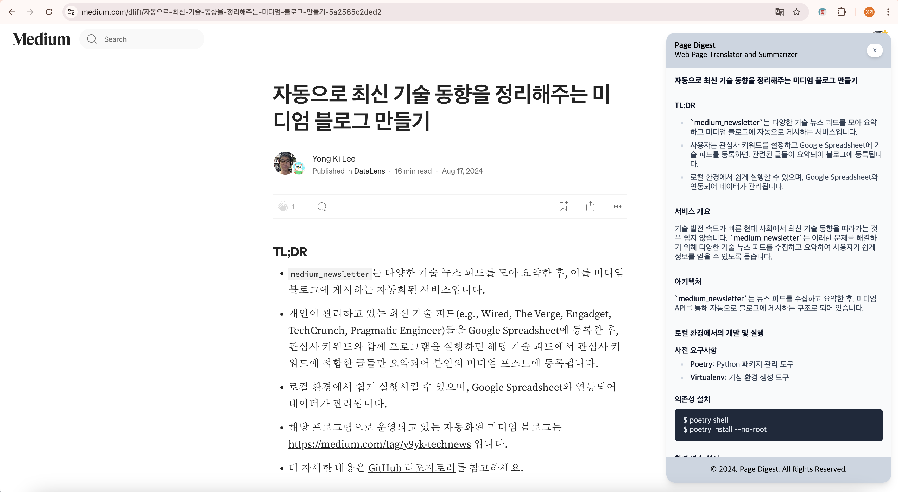

# page-digest

웹 페이지를 빠르게 요약해주는 extension 서비스를 지원합니다.

\*지원하는 브라우저는 아래와 같습니다.

- chrome

---

# Getting Started

## Prerequisites

- node.js (version >= 20)

## Build from source

1. 아래의 명령어를 실행합니다.

```bash
$ npm start
```

2. chrome:extension 페이지에 접속합니다.
3. 개발자 모드를 활성화시킵니다.
4. 1번의 명령어로 생성된 `chrome/build` 디렉터리를 로드합니다.
5. 아래와 같이 설치된 Chrome Extension을 실행합니다.



# Refer to

- https://github.com/clmnin/summarize.site
